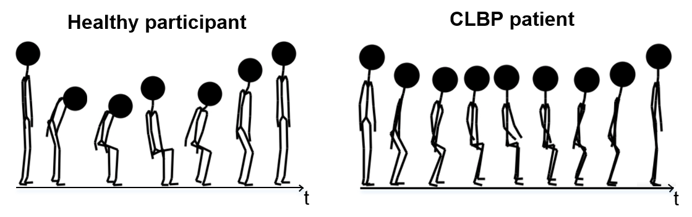
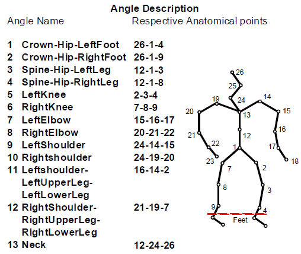
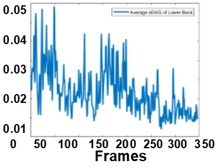
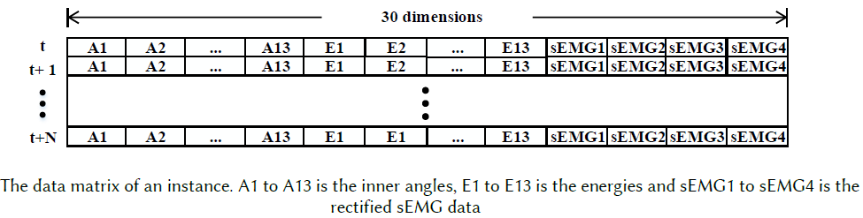
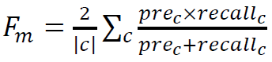

## Challenge Description
The EmoPain Movement Behavior challenge comprises two tasks based on the EmoPain dataset, participant need to complete at least one of tasks:
- **Task 1**: Protective Movement Behavior Detection with MoCap and surface EMG data: In this task, a binary detection model is required to detect the moment of protective behaivor exhibited by patients in a continous way. Data collected from healthy subjects without positive protective labelling are also provided. Participants may refer to previous papers [Aung et al. 2014](https://dl.acm.org/citation.cfm?id=2686916), [Aung et al. 2016](https://ieeexplore.ieee.org/abstract/document/7173007), [Wang et al. 2019a](https://arxiv.org/abs/1902.08990), [Wang et al. 2019b](https://arxiv.org/abs/1904.10824). The training and validation set comprise continuous movement plus sEMG data with continuous binary groudtruth  (per timestep) of selected subjects. The testing set comprises N data windows of the rest subjects with 3s length and 75% overlapping ratio, results reported from you should be N predicted labels.

- **Task 2**: Pain-level Recognition with Mocap and surface EMG data: Here, participants need to use the movement and surface EMG data to predict the pain-level of the subject during a movement instance. Three categories are included: No Pain, Low-level Pain, High-level Pain. Participants may refer to previous papers [Olugbade et al. 2014](https://dl.acm.org/citation.cfm?id=2663261), [Olugbade et al. 2015](https://ieeexplore.ieee.org/abstract/document/7344578), [Olugbade et al. 2018 (https://ieeexplore.ieee.org/abstract/document/8269804), [Olugbade et al. 2019](https://dl.acm.org/citation.cfm?id=3299095). The training and validation set comprise movement instances (complete movement segments) of each selected subjects, while groudtruth of 3 categories is providede per instance. The testing set comprises N movement instances of the rest subjects, results reproted from you should be N predicted labels.

- **Task 3**: Pain-level Recognition from facial expression: More information comming soon.

## Dataset

The EmoPain dataset we provided contains full-body MoCap data and surface EMG data collected from 4 places on the back, captured from 12 healthy subjects and 18 patients. Continuous labelling of protective movement behavior is provided per timestep, while the label of pain-level is provided per movement instance. 
 
Due to GDPR regulations, the specific data we included are low-level mathematic features of the original data: 
- **Angles** (calculated from each three relevant anatomical points) and **Energies** (the respective angular velocities) for the description of movement. See the diagram took from [Wang et al. 2019b](https://arxiv.org/abs/1904.10824):

- **Upper envelope of the surface EMG data** for the description of muscle activity. See the diagrams took from [Aung et al. 2016](https://ieeexplore.ieee.org/abstract/document/7173007), [Wang et al. 2019a](https://arxiv.org/abs/1902.08990):

As a result, the data matrix provided will looks like (took from [Wang et al. 2019a](https://arxiv.org/abs/1902.08990)):

The dataset is divided randomly into 
- Training Set (10 patients, 6 healthy subjects)
- Validation Set (4 patients, 3 healhy subjects)
- Testing Set (4 patients, 3 healthy subjects)

## Participate
To participate in the EmoPain movement behavior challenge, please download, fill and sign the form (link is coming soon).
 
Then return the form to 
 
emopain19@gmail.com
 

After the release of testing data, each team has 5 chances to upload the required results.

The performance rank will only be put online before the workshop day.

## Metric
For task 1, we use the mean F1 score as the metric:

where the pre and recall is the precision and recall ratio of class c (c=2, protective and non-protective).

For task 2, we use

## Paper Submission
Paper will be submitted through EasyChair(Link is coming soon).
 
We are expecting at least 20 submissions and we plan a 50% acceptance rate. 
 
We have received many requests for access to the EmoPain dataset and this challenge is an opportunity to open it. 
 
Paper length will be up to 7 pages (6 pages + 1 page for references). 
The reviewing process will be double blind.

## Important Dates
- Challenge Website Up: 6th of May, 2019
- Training and Validation Data Available: 8th of May, 2019
- Testing Data Available: 27th of May, 2019 
- Results Uploading Deadline: 9th of June, 2019
- Paper Submission Deadline: 18th of June 2019
- Notification: 8th of July 2019 
- Camera Ready due: 12th of July, 2019 
- Workshop Date: 3rd of September, 2019

## Keynote Speakers

#### [Professor Rebecca Slater, Oxford University, UK (tentative)](https://www.paediatrics.ox.ac.uk/team/rebeccah-slater)
#### [Professor Chris Eccleston, University of Bath, UK (tentative)](https://researchportal.bath.ac.uk/en/persons/chris-eccleston)

We also aim to have a multidisciplinary panel (in line with the inclusion theme of ACII 2019) on the requirements and challenges from 
real world applications for the above-discussed technology.
 
We hope that the discussion will trigger interest that leads to new approaches for developing automatic recognition systems. 
 
The panel will be led by a member of the organizing committee (Dr Amanda Williams, clinical psychologist and academic expert in pain) and include 2 keynote speakers (see above), a senior physiotherapist (Mr Diarmuid Denneny, Pain Management Centre, UCLH NHS Foundation Trust, UK) and an HCI researcher (Dr Aneesha Singh, UCL, with long-term research experience with pain patients).
