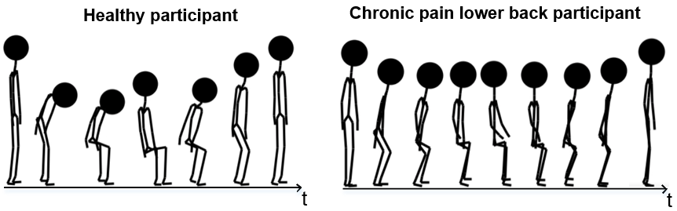
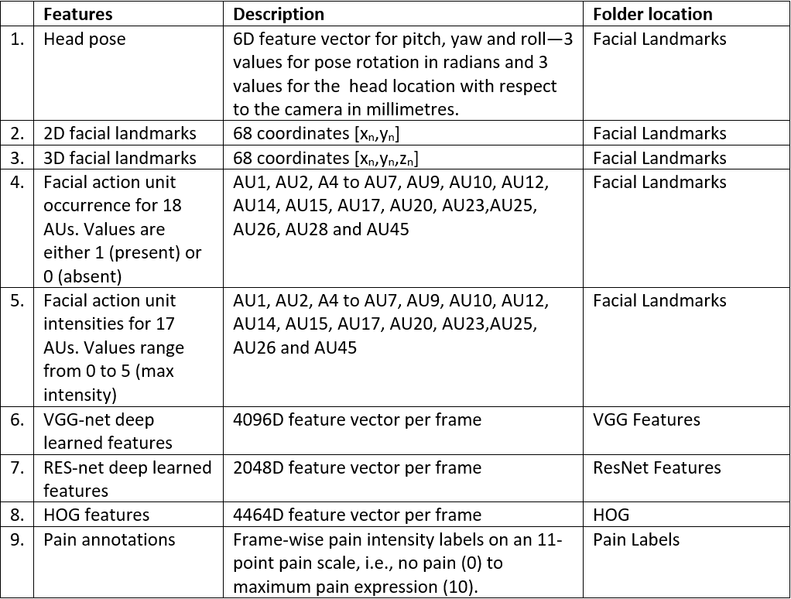
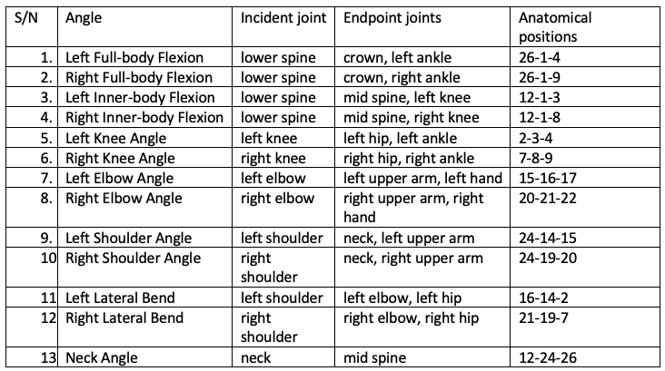
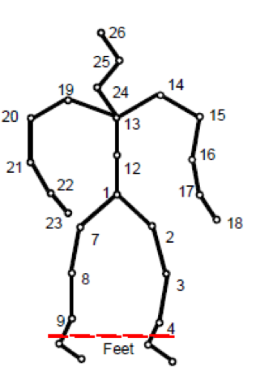
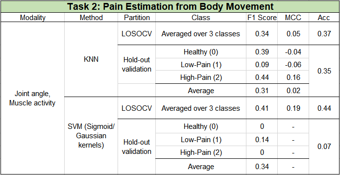
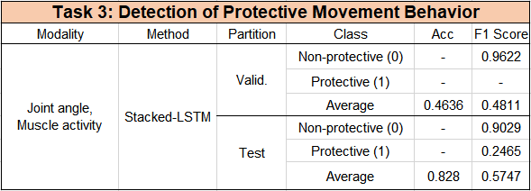
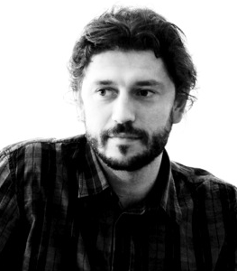

## Scope
Chronic pain is a major problem facing individuals, families, healthcare providers, and society as a whole. Technology that can assess the behaviour of a person with chronic pain and associated levels of pain and related states could deliver personalised therapies and support in long-term self-management of the condition particularly aiming to improve engagement in valued everyday physical activities. This vision is based on the multidisciplinary approach to chronic pain management advocated by clinicians and grounded in findings in pain research of the importance of addressing pain as a multifaceted experience (with physical, psychological, and social factors and outcomes). The EmoPain challenge provides an opportunity for the FG community to collectively contribute to solving the fundamental problem of automatic detection of pain behaviours and pain levels, based on real data collected from people with chronic pain performing movements that are identical to those that make up daily physical functioning.
 

The EmoPain challenge, to be held in conjunction with FG2020 is the first international challenge addressing pain and related behaviour detection. It is based on the EmoPain dataset which contains both face and multimodal movement data from real participants with chronic pain performing physical activity. Previous related benchmark datasets have been aimed at detection from facial cues (The UNBC-McMaster Shoulder Pain Expression Archive Database [Lucey et al. 2011](https://ieeexplore.ieee.org/abstract/document/5771462)) or experimental pain (Biovid Heat Pain Database [Walter et al. 2013](https://ieeexplore.ieee.org/abstract/document/6617456)) whereas body movement is a critical modality to consider in assessing pain experience. This is also the first time a controlled challenge in pain behaviour is held such that competitors only have access to the training and validation partition, while test partition is held back for performance comparison to ensure a level playing field. Participating teams will be required to send working programs, together with clear documentation of any input and output parameters and the organisers will run thee on the test data. Details of the challenge tasks and guidelines are provided below.
 

The organisers will write a baseline paper detailing the Challenge’s objectives, rules and baseline methods for comparison. This will include baseline experimental results on the test partition and would be available on the challenge website from 24th January 2020. To save space, participants are kindly requested to cite the baseline paper instead of reproducing the method descriptions and results contained in the paper.

## Challenge Description
The EmoPain 2020 Challenge consists of three main tasks focussed on pain recognition from facial expressions and body movements, as well as the recognition of pain-related body movements. Participants are expected to complete at least one of them. All tasks are based on the EmoPain dataset and are described as follows:

- **Task 1 - Pain Intensity Estimation from Facial Expressions**  
This task aims to develop methods that can recognise different levels of observer-rated pain in participants with chronic low back pain based on their facial expression changes during exercise performance. Participants would be expected to train regression/classification models to predict pain intensity from facial expressions on a continuous 11-point scale in which healthy participants have a score of 0 while participants with chronic pain have scores between 1 and 10 inclusive. A zero pain score is assumed for the healthy control group thus, participants may find it valuable to devise techniques that take into account the uncertainties which could arise from this assumption. 
We provide training, validation, and test data, which comprise of features extracted from face videos of CLBP and healthy control participants. Facial features include facial landmarks, head pose, Histogram of Oriented Gradient (HOG) features, action unit occurrence and intensity values extracted from [OpenFace](https://github.com/TadasBaltrusaitis/OpenFace), and deep-learned feature representations. Table 1 below shows the detailed description and the dimensions of the facial expression data. A README document will be attached to the data to provide more information.

  
Table 1. Facial expression features description

- **Task 2 - Pain Recognition from Movement Task**   
Participants of this task will be required to build a classification model that determines based on the bodily joint features and muscle activity data if a participant has chronic pain or is a healthy control participant and further differentiate between two levels of pain (i.e. low-level pain and high-level pain) if with chronic pain.  
We provide training, validation, and test data, which comprise joint angles and energies as well as sEMG data from both participants with CLBP and healthy control participants. Figure 1 shows a description of the joint angles. The sEMG data provided was obtained from the upper envelope of the rectified sEMG sensor as shown in Figure 2. The data also comes with three class labels per instance. The pain labels will serve as ground truth for this task. A README document will be attached to the data to provide more detailed information.

 
Figure 1. Joint angle illustration  
  
Figure 2. sEMG data from 4 sensors on the back

- **Task 3 - Movement Behaviour Classification**  
Participants of this task will be required to build a model for binary classification of protective behaviour at each movement frame in the exercise performance of a participant with chronic pain based on the bodily joint features and muscle activity data.  
We provide training, validation, and test data, which comprise joint angles and energies as well as surface electromyography (sEMG) data from both participants with CLBP and healthy control participants. See Figure 1 for a description of the joint angles (picture took from [Wang et al 2019](https://arxiv.org/abs/1904.10824)) and Figure 2 for the sEMG capturing. The data comes with **continuous binary** labels (i.e. one label per timestep). The protective behaviour labels will serve as ground truth for this task.

## Dataset Partition
The face dataset comprising 36 participants is partitioned randomly into 
- Training Set (8 CLBP participants, 11 healthy participants)
- Validation Set (3 CLBP participants, 6 healhy participants)
- Test Set (3 CLBP participants, 5 healhy participants)

The movement challenge dataset comprising 30 participants is partitioned randomly into 
- Training Set (10 CLBP participants, 6 healthy participants)
- Validation Set (4 CLBP participants, 3 healhy participants)
- Test Set (4 CLBP participants, 3 healhy participants)

## Performance Metrics
- **Pain estimation from facial expressions**  
Submissions to the facial expression challenge will be evaluated and compared using Concordance Correlation Coefficient (CCC) as it provides a measure of the temporal association between the model predictions and ground truth pain labels. Mean-Square-Error (MSE), Mean-Absolute-Error (MAE), and Pearson Correlation Coefficient (PCC) will additionally be computed for comparison with previous findings in the literature.

- **Pain recognition from Multimodal movement**  
For comparison of submitted models, Matthews Correlation Coefficient [Matthews 1975](https://www.sciencedirect.com/science/article/pii/0005279575901099) (MCC), which takes into account the positive class as well as the negative classes, will be used. F1 scores for all classes in the tasks (i.e. F1 score and inverse F1 scores) and accuracy will also be computed for comparison with existing literature.

- **Multimodal movement behavior classification**  
The mean F1 score and seperate F1 scores for each class (protective class and non-protective class).

## Participate
Participants should download, fill, and sign the end-user license agreement ([EULA](https://github.com/Mvrjustid/EmoPainChallenge2020/tree/master/Docs)). The completed form should be sent to the [committee](mailto:emopain2020@gmail.com). Upon satisfactory completion and return of the form, the link to the training and validation sets will be emailed to the participant. 
 

Participating teams will be expected to attempt at least one or more of the challenge tasks and send their trained models (in the form of a working code) and a clear description of any input and output parameters to the [committee](mailto:emopain2020@gmail.com) before the stipulated deadline. Links to trained models can be shared with the organizers via cloud platforms, e.g., Google Drive, Dropbox or One-drive.
 

Participating teams can submit up to three different models for each task. The organisers will make reasonable attempts to run submitted code within five working days, and the teams can make repeated submissions to fix bugs in their code before the submission deadline. Note that repeated submissions to bug-fix code do not count towards the number of models a participating team can submit.
 

At the end of the competition, the test results for all participants will be published on the Challenge's website. Participants will be ranked based on the performance metrics described above, and the winner(s) will be selected as the best performing submission. Prizes will be presented to the winning teams during the workshop program at the FG2020 conference.

## Paper Submission
Each participating team would be required to submit a paper to the workshop, describing their proposed approach for tackling the challenge tasks as well as the results obtained. The organisers reserve the right to re-evaluate the findings, but will not participate in the challenge themselves. Participants are encouraged to compete in the three tasks. Submission should follow the FG 2020 stipulated guidelines for short papers, i.e., 4 pages + 1 page for reference. The review process will be double-blind.  More information on paper submission timelines is provided below. Please submit your paper through [EasyChair](https://easychair.org/conferences/?conf=emopain2020 ).
 

In addition to the paper describing the dataset ([Aung et al 2016](https://ieeexplore.ieee.org/abstract/document/7173007)) mentioned in the EULA, we will produce a paper describing the features extraction methods used in the three tasks (as described above) and the baselines for this challenge. This paper will be ciruculated later to the challenge participants. This paper should be cited in the challenge camera ready paper.
 

The results of the challenge will be presented at the EmoPain 2020 workshop to be held in conjunction with the [Automatic Face and Gesture Recognition 2020](https://fg2020.org/) conference in Buenos Aires, Argentina.

## Baseline Results
Here we provide the results we have using some baseline systems. 
- **Task 1 - Pain Intensity Estimation from Facial Expressions**   
See the table below. In this task, the hold-out validation is used.

  
Table 2. Baseline results for pain intensity estimation from facial expressions

- **Task 2 - Pain Recognition from Movement**   
See the table below. In this task, we performed leave-one-subject-out cross-validation (LOSOCV) based on the training set as well as hold-out validation based on the training, validation, and test sets respectively.

  
Table 3. Baseline results for pain intensity estimation from movements

- **Task 3 - Movement Behaviour Classification**   
See the table below. In this task, the hold-out validation is used.

  
Table 4. Baseline results for movement behaviour classification

## Important Dates

- 01 Oct 2019: Call for participation announced, data available (data, READMEs, and website draft are already ready for dissemination)
- 19 Jan 2020: Final submission of challenge systems for evaluation
- 24 Jan 2020: Paper submission deadline
- 27 Jan 2020: Papers assigned to reviewers
- 11 Feb 2020: Review deadline
- 14 Feb 2020: Decisions sent to authors
- 21 Feb 2020: Camera ready version to Challenge Organisers via EasyChair
- 28 Feb 2020: Camera ready versions to FG Publication Chairs

## Organisers
**General Chairs**  

<pre>
   
  Prof Nadia Berthouze      Dr. Amanda Williams      Dr. Michel Valstar        Dr. Hongying Meng 
           UCL                       UCL          University of Nottingham  Brunel University London
  
      Dr. Min Aung           Dr. Nicholas Lane           
University of East Anglia   University of Oxford              
</pre>
 

**Data Chairs**  

<pre>
   
      Dr. Joy Egede        Dr. Olugbade Temitayo       Chongyang Wang             Siyang Song 
 University of Nottingham            UCL                     UCL           University of Nottingham
</pre>
 

## Keynote Speakers
Stay tuned.

## Programme
Stay tuned.
